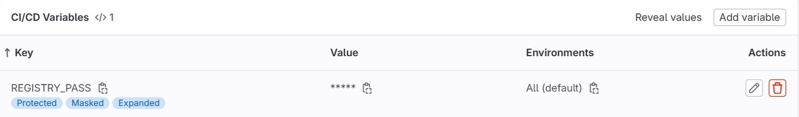

It's a CI/CD pipeline for dev, test, and prod environments built with GitLab, Helm and ArgoCD.

# CI Pipeline

For the CI part please clone this [repository](https://gitlab.com/zdgul/express-api) to your local host. 

In GitLab, after adding $REGISTRY_PASS which is your Docker Hub's password as a variable from Settings -> CI/CD -> Variables, automatic image building will be triggered.



# CD Pipeline

> For the CD part, I used **Minikube** on a Docker driver. Please set your environment through [instructions](https://minikube.sigs.k8s.io/docs/start/) before move on.

You need to set your credentials as a Kubernetes Secret to pull an image from private registry:

```
kubectl create secret docker-registry regcred --docker-server=https://index.docker.io/v1 --docker-username=<your-name> --docker-password=<your-pword> --docker-email=<your-email>

```

After pulling this repository to your local, please configure your image and tag name of your registry through:
- values.yaml
- /test/values-test.yaml
- /prod/values-prod.yaml

For my example, I used **zdgul/myapp:rest-api-4.5** image but since it is a private registry, you need to use your own registry to pull image.

After then, please install both ArgoCD CLI and UI through [instructions](https://faun.pub/argo-cd-helm-the-gitops-way-of-deploying-applications-af158420bde5).


# Dev Environment Setting

```
argocd app create myhelmapp --repo https://github.com/zgulhan/helm-myapp.git --path myhelmapp --dest-server https://kubernetes.default.svc --dest-namespace default

argocd app sync myhelmapp
```

> Please change --repo with your own repository.


# Test Environment Setting
```
argocd app create myhelmapptest --repo https://github.com/zgulhan/helm-myapp.git --path myhelmapp/test --values values-test.yaml --dest-server https://kubernetes.default.svc --dest-namespace test

argocd app sync myhelmapptest
```

> Please change --repo with your own repository.

# Prod Environment Setting
```
argocd app create myhelmappprod --repo https://github.com/zgulhan/helm-myapp.git --path myhelmapp/prod --values values-prod.yaml --dest-server https://kubernetes.default.svc --dest-namespace prod

argocd app sync myhelmappprod
```

> Please change --repo with your own repository.

# Conclusion

